## Vbox - MobaXTerm 가상 서버 연동

1. 가상머신의 centos terminal에서 ip addr 명령어를 통해 ip를 확인해 준다. 표시 된 부분이 필요하니 적어둬야 한다.

   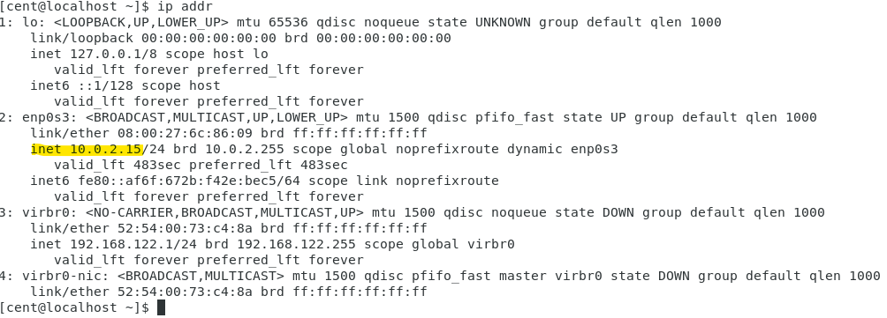

2. 로컬 환경의 cmd창에서 ipconfig 명령어를 통해 로컬 pc의 ip를 확인해 준다. 이때 VirtualBox Host-Only Network에 명시된 ip를 확인해야 하며, 역시 표시된 부분이 필요하니 적어둔다.

   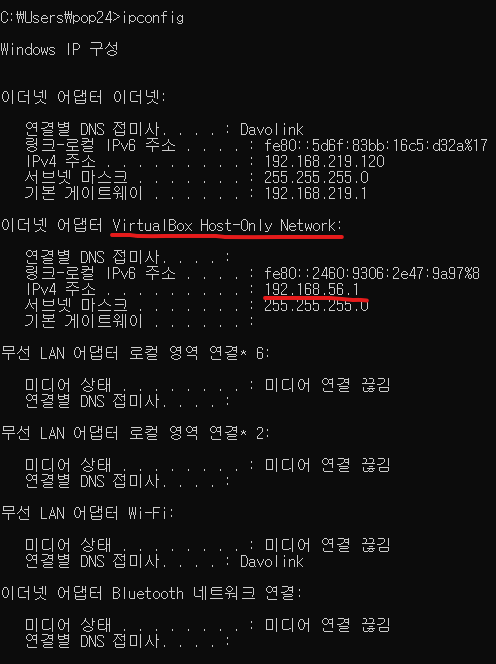

3. vbox 메인 화면에서 파일-환경설정에 들어간다.

   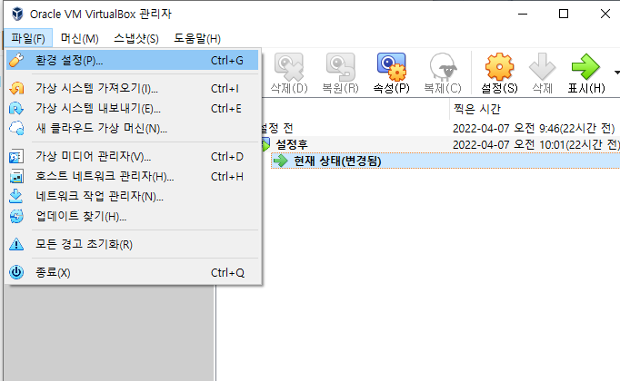

   

   

4. 네트워크 탭에서 표시된 부분을 클릭하여 새로운 NAT 네트워크를 추가해준다. 

   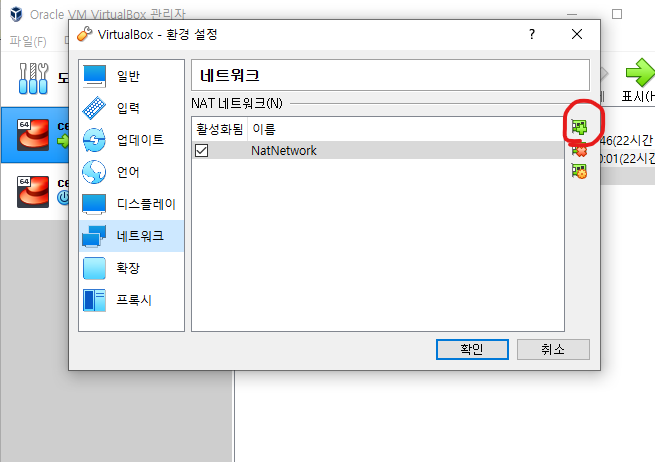

5. 추가된 네트워크를 더블클릭하면 네트워크 정보창이 뜨는데, 하단의 포트 포워딩을 클릭한다.

   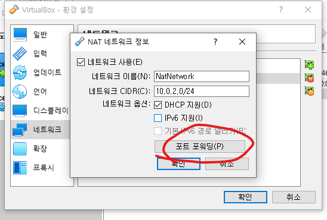

6. 포트 포워딩 규칙을 명시해준다. 호스트IP는 로컬 pc에서 ipconfig를 통해 확인한 IP, 게스트IP는 가상머신 환경에서 ip addr 명령어를 통해 확인한 IP다. 포트는 기본적으로 22로 사용한다.

   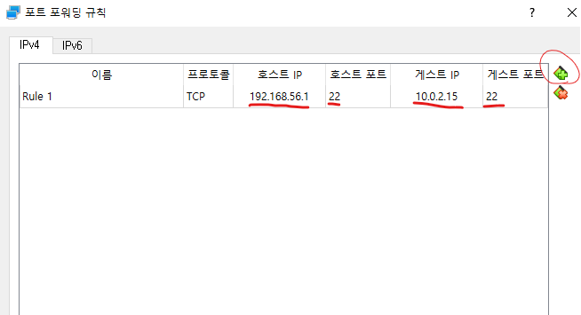

7. 설정을 마친 후 메인화면에서 사용할 가상환경을 좌측에서 클릭한 후 설정 버튼을 클릭한다.

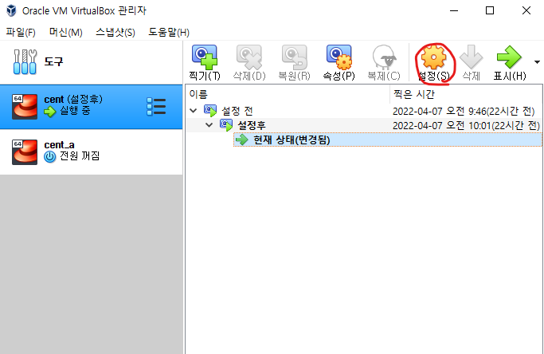

8. 네트워크 탭에서 '다음에 연결됨' 항목을 NAT 네트워크로 변경해준 후 확인을 누른다. (여기까지 vbox 설정 끝)

   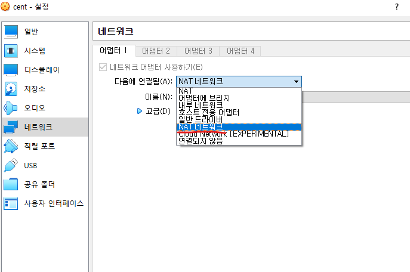

9. 모바텀을 실행해서 상단의 session - newsession을 클릭한다.

   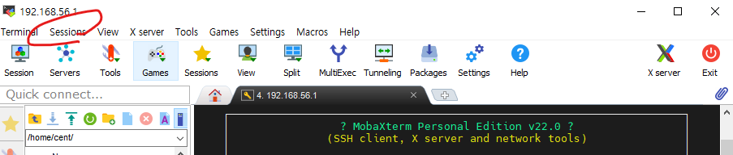

10. ssh로 접속하기 위해 상단의 ssh를 누르고 remote host 란에 로컬 pc의 IP를 기입해 준 후 하단의 ok 버튼을 클릭한다.

    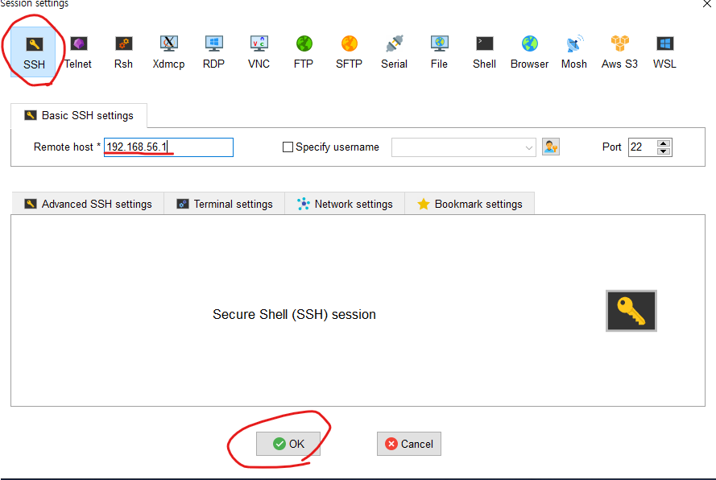

11. 자동으로 실행되어 접근을 시도하게 되는데, login as 란에는 가상환경의 사용자 이름을, password란에는 가상환경 사용자의 비밀번호를 입력해준다.

    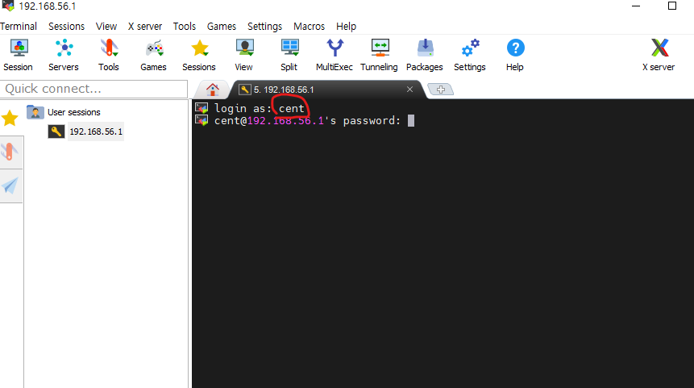