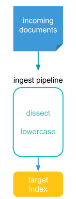
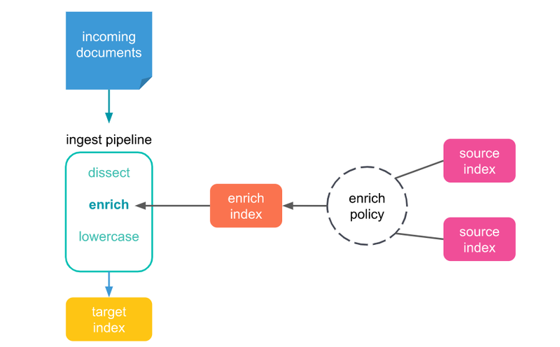

# Elasticsearch Enrich

es는 다양한 데이터 소스의 데이터를 indexing해서 빠른 검색과 분석이 가능하다. 데이터 엔리치먼트

es 7.5 버전 이상부터는 기존 index의 데이터를 새로 인덱싱 되는 index에 원하는 대로 추가하는 작업이 Enrich Processer를 통해 가능해졌다. 다음과 같은 작업이 손쉽게 가능해졌다. 

▶ IP address를 통해서 연관된 디바이스나 서비스 정보들을 추가하기

▶ 상품 주문 데이터의 Product ID를 통해서 상세 제품 정보 데이터를 추가하기

▶ 이메일 주소를 통해서 상세 컨택 포인트 정보를 추가하기

▶ GPS의 정보를 통해서 우편 번호 정보를 추가하기 등등

## Enrich Processor의 동작 원리

es의 데이터 노드는 ingest 노드 이기도 한데, 인제스트 노드의 인제스트 파이프라인은 다음과 같이 작동한다. 각각의 인제스트 프로세서들이 document에 대해 특정 작업을 순서대로 실행하고 그 결과를 인덱싱한다.




enrich processor는 기존에 인덱싱된 문서의 데이터를 lookup 해서 새로운 데이터를 추가할 수 있다. enrich processor를 사용하기 위해서는 enrich policy, source index, enrich index를 설정하고 인제스트 파이프라인에 추가하는 형태로 동작하게 된다. 



#### enrich policy

enrich policy는 크게 아래와 같은 네 가지 설정 옵션을 가지고 있다.

-  source indices : 추가할 데이터를 가지고 있는 데이터 소스들(*source indices)*의 리스트

-  policy type : 어떻게 추가할 데이터를 매칭(Matching)할 지에 대한 방법

-  match field : 입력되는 데이터와 매칭하는 데 사용될 source indices의 필드(Field)

-  enrich fields : match field가 매칭하면 실제로 추가할 source indices의 필즈(Fields)


enrich process를 사용하기 전에 먼저 enrich policy가 실행되어야 한다. enrich policy가 실행 되면 정책에 따라 source indices에서 enrich fields를 추출해서 enrich index라고 하는 새로운 인덱스를 먼저 생성하게 된다. 그 다음에는 enrich process가 이 인덱스를 사용해서 match field의 값이 서로 매칭이 되면 enrich fields의 데이터를 입력되는 문서에 추가해서 그 결과를 내보내게 된다. 

## enrich processor 예제

여러 가지 enrich policy 중에서 match enrich policy 인제스트 파이프라인(Ingest Pipeline)을 구성해 볼 것이다.

1. 먼저 컨택포인트 데이터를 가지고 있는 source index를 생성한다.

   ```json
   PUT /users/_doc/1?refresh=wait_for
   {
       "email": "mardy.brown@asciidocsmith.com",
       "first_name": "Mardy",
       "last_name": "Brown",
       "city": "New Orleans",
       "county": "Orleans",
       "state": "LA",
       "zip": 70116,
       "web": "mardy.asciidocsmith.com"
   }
   ```

2. put enrich policy API를 통해 enrich policy를 생성한다.

   ```json
   PUT /_enrich/policy/users-policy
   {
       "match": {
           "indices": "users",
           "match_field": "email",
           "enrich_fields": ["first_name", "last_name", "city", "zip", "state"]
       }
   }
   ```

3. enrich policy를 실행시켜 enrich processor가 사용하게 될 시스템 인덱스인 enrich index를 생성한다.

   ```json
   POST /_enrich/policy/users-policy/_execute
   ```

4. 실제로 enrich processor로 구성된 간단한 인제스트 파이프라인을 생성한다. 

   ```json
   PUT /_ingest/pipeline/user_lookup
   {
     "description" : "Enriching user details to messages",
     "processors" : [
       {
         "enrich" : {
           "policy_name": "users-policy",
           "field" : "email",
           "target_field": "user",
           "max_matches": "1"
         }
       }
     ]
   }
   #입력되는 문서에 email이라는 이름의 field가 있으면 그 필드의 값이 enrich index의 match_field와 일치하는 지를 확인해서 매칭이 되면 enrich_fields가 target_field인 "user" 필드가 추가된다.
   ```

5. email 주소를 가진 문서를 위의 인제스트 파이프라인을 통해서 인덱싱 한다.

   ```json
   PUT /my_index/_doc/my_id?pipeline=user_lookup
   {
     "email": "mardy.brown@asciidocsmith.com"
   }
   ```

6. 확인해보면 다음과 같은 결과를 볼 수 있다.

   ```json
   GET /my_index/_doc/my_id
   
   
   {
     "found": true,
     "_index": "my_index",
     "_type": "_doc",
     "_id": "my_id",
     "_version": 1,
     "_seq_no": 55,
     "_primary_term": 1,
     "_source": {
       "user": {
         "email": "mardy.brown@asciidocsmith.com",
         "first_name": "Mardy",
         "last_name": "Brown",
         "zip": 70116,
         "city": "New Orleans",
         "state": "LA"
       },
       "email": "mardy.brown@asciidocsmith.com"
     }
   }
   ```

   