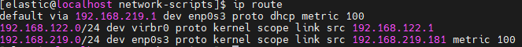
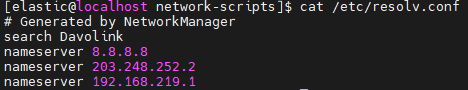
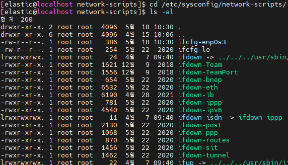
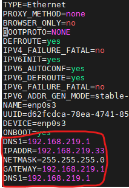

# centos7 고정 ip 할당

## 1. gateway/DNS/netmask 확인

##### gateway

```bash
[root@localhost] ip route 
```



첫 줄의 default via 에 적힌 ip 주소가 gateway 값이다.


##### DNS

```bash
[root@localhost] cat /etc/resolv.conf
```



명령어를 입력면 ip가 몇 개 출력 된다. 위에서 부터 차례대로 DNS1,DNS2 라고 생각하면 된다.


##### Netmask

이건 더 알아봐야 할 것 같다. 일단 255.255.255.0 으로 설정했다.


## 2. 설정 변경 및 적용

```bash
[root@localhost network-scripts] cd /etc/sysconfig/network-scripts/ 
[root@localhost network-scripts] ls -al
```



위의 설정 파일 중, 현재 사용하고 있는 network의 이름을 찾아서 수정해준다.(ifcfg- 로 시작하는 파일) 현재 사용하는 network의 이름은 enp0s3 이기 때문에 ifcfg-enp0s3 파일을 수정해준다.

```bash
[root@localhost network-scripts] vi ifcfg-enp0s3
#파일을 열어보면 다음과 같은 내용을 볼 수 있다. 
TYPE=Ethernet
PROXY_METHOD=none
BROWSER_ONLY=no
BOOTPROTO=dhcp
DEFROUTE=yes
IPV4_FAILURE_FATAL=no
IPV6INIT=yes
IPV6_AUTOCONF=yes
IPV6_DEFROUTE=yes
IPV6_FAILURE_FATAL=no
IPV6_ADDR_GEN_MODE=stable-privacy
NAME=enp0s3
UUID=d62fcdca-78ea-4741-8552-720da8eca12e
DEVICE=enp0s3
ONBOOT=yes
DNS1=192.168.219.1
```

여기서 수정해야 할 부분은 BOOTPROTO이다.  해당 값을 NONE로 변경한 후, 몇 가지 설정을 추가해준다. 1번에서 확인한 gateway,dns,netmask값을 설정 한다. 그리고 IPADDR 항목에 고정 ip로 사용하고 싶은 주소를 설정해 준다. 



설정이 끝났다. 이제 network를 재시작 하면 변경한 ip를 고정으로 사용할 수 있다.

```bash
[root@localhost network-scripts] systemctl restart network
```

